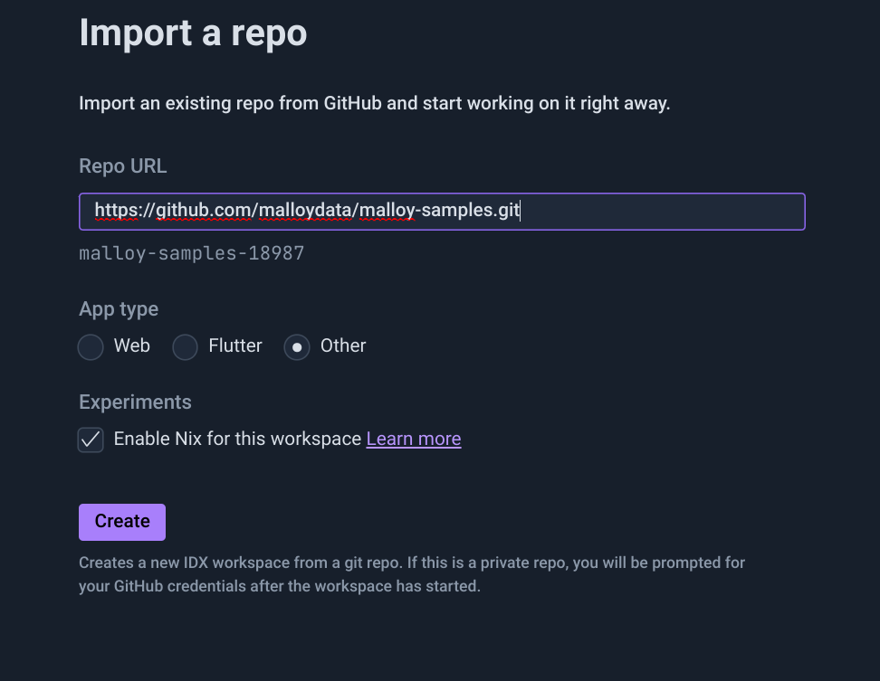
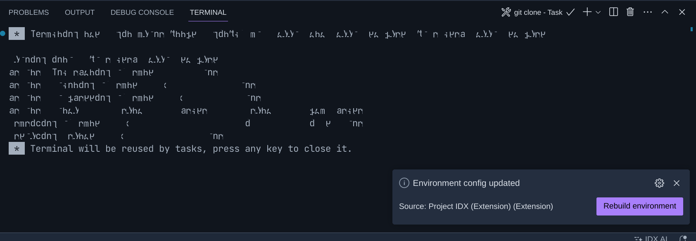
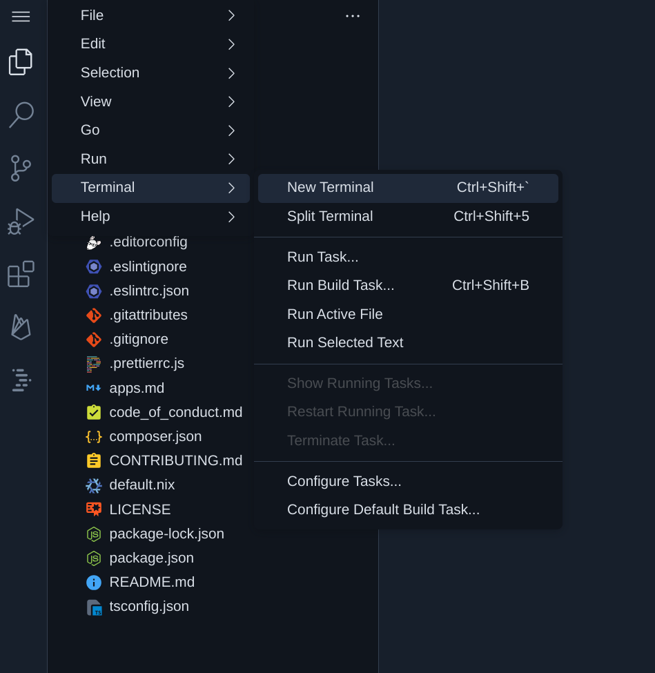

>>>markdown
# Using Google's Project IDX with Malloy
Google recently announced [Poject IDX](https://developers.googleblog.com/2023/08/introducing-project-idx-experiment-to-improve-full-stack-multiplatform-app-development.html) and Cloud based AI powered coding development enviornment.  It turns out that this environment makes a pretty fabulous development environment for working with [Malloy](https://www.malloydata.dev).  

A Project IDX development environment consists configurable clouds instance, VSCode and AI to help you.  We've configured some of our Malloy repositories so that when you open them in Project IDX, everything is setup to run, all you need to do is log into gcloud at the command line.

## Setting it up
The first thing is to join the waitlist for [Project IDX](https://idx.dev).  Once you've done this, [ping the Malloy team in the Slack channel](carlin-link-here) and we'll use our insider influence to help expedite the process.

## Import a Repo 
Project IDX gives you several choices in starting machine instances.  Choose "Import a Repo" and click 'enable Nix for this workspace'.  [Nix](https://nixos.org) is a way of configuring development environmennts (more on this later).  You can think of it as a super light weight Docker.



Once you've click create you will see a bunch of messages things being created for you.  **Try not to click on things while this is happening**. 

## Rebuild Environment

Eventually, in the lower left corner you will see a button that says **Rebuild Enviornment**.  Click it.  This button tells Project IDX to install all the stuff specified in ~/.idx/dev.nix (Malloy and other tooking).  If you don't see this button, make any change to the above file and the button will re-appear.

You should see another set of screens about installing stuff and then ultimately you should be back in VSCode.



## Log into gcloud

The final setp in setting up your Project IDX with Malloy is to log into gcloud so you can run queries against BigQuery.

Open a new terminal window by Clicking the three lines in the upper left corner.  




In terminal log into gcloud by running the commands (using your project)

```
gcloud auth login --update-adc
gcloud config set project {my_project_id}
```

## Test your BigQuery connection

Open ~/bigquery/faa/airports.malloy and click `Run Query` on any of the queries.  

Everything should be setup.

As always, [please visit our Slack Communitity] if you have any problems or feedback.
